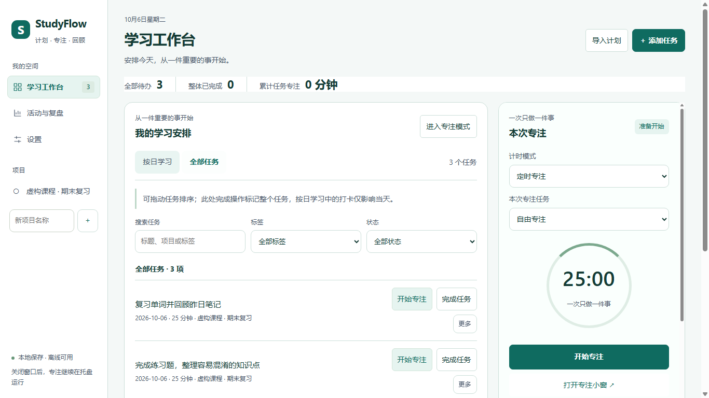

# StudyFlow

### 面向 Windows 的本地学习计划与专注计时应用

**安排每日计划，一次专注一件事，再用有效学习时间检视计划。任务、复盘和活动记录保存在自己的电脑上，无需注册账号。**

[English](README.md) | 中文

[功能](#功能) · [快速开始](#快速开始) · [使用方法](#使用方法) · [文档](#文档) · [开发](#开发)



*当前 Windows 应用的真实界面，使用虚构演示数据。界面语言为中文。*

## 功能

- **项目与每日计划**：创建带估时、标签和前置依赖的任务，支持搜索、排序、删除恢复；按日历查看安排、重复练习，并对不同日期独立打卡。
- **专注计时**：倒计时、正计时与番茄钟，支持暂停和继续，可选长专注与微休息；置顶小窗显示今天累计专注时长，主窗口关闭到托盘后继续计时。
- **本地计划导入**：选择 JSON 或 XLSX 文件，也可粘贴 JSON。保存前预览任务、日期、时长和变更；支持项目复用、计划合并、明确整日替换和重复导入跳过。
- **活动与温和提醒**：识别 Windows 前台应用，将 AFK 和未知时间排除在有效学习之外，为白名单以外的应用显示提醒；可选每日计划提醒、本地白噪音和音乐。
- **每日复盘**：查看学习与应用时间线，手工设置应用分类，对比计划与实际分钟，记录完成内容、遇到的问题和明天的调整。

独立桌面版运行不依赖 Super Productivity 或 ActivityWatch。核心功能离线可用；安装依赖和首次下载 Electron 需要网络。

## 快速开始

### 从源码运行

使用 **Windows x64**、**Node.js 24 与 npm**，以及 Windows **.NET Framework 4.x 的 C# 编译器**。构建脚本使用系统 Windows 目录下的 `Microsoft.NET/Framework64/v4.0.30319/csc.exe`。依赖版本由 `package-lock.json` 固定。

```powershell
git clone https://github.com/cloudwallker/StudyFlow.git
cd StudyFlow
npm ci
npm run install:electron
npm run start:desktop
```

`start:desktop` 会先构建，再启动独立桌面版。首次下载的 Electron 缓存在 `.cache/electron/`。不需要同级上游源码目录、Python、`.env`、API 密钥或应用账号。

仓库提供源码、测试和模板；克隆仓库不会取得已经打包好的 Windows 应用。

### 构建 Windows 便携包

安装依赖和 Electron 后执行：

```powershell
npm run package:desktop
npm run verify:package
```

便携目录生成在 `release/<构建时间>/StudyFlow-win32-x64/`，当前生成位置写入 `dist/desktop-package-path.txt`。在完整目录中运行 **StudyFlow.exe**，也可使用同目录的 `install-studyflow.cmd` 安装。请保留整个便携目录。打包后的应用无需另装 Node、Python、Super Productivity 或 ActivityWatch。

## 使用方法

1. 创建项目与任务，或点击 **导入计划**，选择 [JSON 模板](examples/studyflow-plan.json)、[Excel 模板](examples/studyflow-plan.xlsx) 或粘贴 JSON。核对预览后确认保存。
2. 在 **按日学习** 中选择日期并开始计划任务；**全部任务** 也会列出未安排日期的任务。当日打卡和整体任务完成互相独立。
3. 选择计时模式和任务，再开始专注。编辑与排序位于 **更多** 中；也可选择不绑定任务的自由专注。
4. 在 **设置** 中保存计时默认值、声音、应用白名单、活动记录开关与每日计划提醒。白名单每行一个完整可执行文件名，例如 `Code.exe`；匹配忽略大小写和首尾空格。
5. 在 **活动与复盘** 中选择日期并点击 **读取日期 / 刷新**，计划与复盘会保存到已经读取的日期。

工作台将任务日历与专注控制放在一起。页面切换保留表单草稿和正在进行的专注。次要任务操作支持键盘与触摸，**Escape** 可关闭已展开的任务菜单。详细操作见[界面使用指南](docs/features/12-frontend-layout.md)。

JSON 计划应明确填写 `YYYY-MM-DD` 日期。日期缺失时，导入预览可根据标题中的天数和指定的第 1 天日期推导。StudyFlow 在本机校验和导入文件，不调用 AI 服务生成或调整计划。

专注小窗显示工作阶段的**累计计时时长**，包含自由专注；每日有效学习还会扣除 AFK 和未知采样，两者可能不同。自由专注在每日复盘中单列，不增加任何任务的累计用时。

## 隐私与数据

- 正常版数据库位于 `%APPDATA%\StudyFlow\studyflow.sqlite`，当前为 schema v7；专属测试版使用 `%APPDATA%\StudyFlow-Test`。
- 会话应用记录与全天独立活动记录均**默认关闭**，可以分别启用。只保存可执行文件名和活动、AFK、未知状态，不记录窗口标题、URL、按键内容或浏览器历史。
- 应用使用本地 HTML、CSS、脚本和 SQLite。正常运行不把任务或活动数据发送到云端、LLM 或遥测服务。
- Windows 锁屏或休眠会暂停计时，返回后需手动继续。会话状态变化及约每 30 秒保存检查点；重启恢复已确认历史，将未结束会话标为中断，不补算停机时间。
- 数据库升级前创建并校验备份。崩溃可能丢失最后成功检查点之后的数据。删除某天历史保留任务累计与计划快照，操作前须关闭并保存全天记录；清理敏感数据时也要检查备份副本。

完整规则和恢复步骤见[数据、备份与恢复](docs/features/07-data-backup-and-recovery.md)及[后台生命周期、隐私与安全](docs/features/08-lifecycle-privacy-and-security.md)。

## 文档

详细用户文档目前以中文提供。

| 指南 | 内容 |
| --- | --- |
| [界面使用指南](docs/features/12-frontend-layout.md) | 工作台、任务操作、导入、设置与复盘 |
| [项目与任务](docs/features/02-projects-and-tasks.md) | 估时、安排、标签、依赖与管理 |
| [专注计时与番茄钟](docs/features/03-timers-and-pomodoro.md) | 计时模式、微休息、声音与专注小窗 |
| [应用采集与提醒](docs/features/04-activity-afk-reminders.md) | 前台应用、AFK、白名单与每日提醒 |
| [历史与复盘](docs/features/05-history-timeline-and-review.md) | 时间线、应用分类与复盘文本 |
| [每日计划与对比](docs/features/06-daily-plan-and-comparison.md) | 计划快照与有效学习时间 |
| [备份与恢复](docs/features/07-data-backup-and-recovery.md) | 数据库升级、检查点与手工恢复 |

## 开发

独立版使用 TypeScript、Electron、本地 HTML/CSS、SQLite 和随包 C# Windows 采集器。领域行为与界面保持分离，测试使用虚构任务及活动数据。

```powershell
npm test
npm run lint
npm run build:desktop
npm run verify:frontend
```

`npm test` 为全量回归，`test:desktop` 仅覆盖其中一部分。`lint` 包含严格 TypeScript 与未使用项检查。`verify:frontend` 使用隔离的虚构数据和模拟采集、声音，检查交互与布局，不读取正常用户数据库。

截至 **2026-10-02**，当前源码通过 **464 项自动化测试**，前端通过 **91 种状态下的 591 项检查**。本轮前端更新跳过人工验收；自动化结果不代表真实锁屏/休眠、长时间运行或干净 Windows 机器兼容性均已验收。

其他 Windows 检查包括 `verify:desktop`、`verify:reminder`、`verify:plan` 和 `verify:focus-mini`。`verify:ambient` 需要 `PATH` 中的 FFmpeg，或通过 `FFMPEG_PATH` 指定路径，用来生成虚构测试音频；FFmpeg 不是应用运行依赖。

`src/desktop/` 包含应用与持久化服务，`src/timer/` 和 `src/activity/` 包含计时与活动规则，`desktop/` 是界面，`native/` 是随包 Windows 辅助程序。旧插件原型保留供参考；`npm run build` 与 `verify:plugin` 对应旧原型，不验证独立桌面版。

## 许可与来源

第三方代码保留原有署名及许可：改造的任务剩余时间工具遵循 [Super Productivity 的 MIT 许可](third-party/super-productivity-LICENSE.txt)，改造的 Windows 采集器保留 [ActivityWatch 的 MPL-2.0 许可](third-party/activitywatch-LICENSE.txt)。见[第三方声明](third-party/README.txt)，随包依赖保留各自适用的许可。

仓库目前未为 StudyFlow 自有代码声明根目录许可证；第三方许可不能代替整个项目的许可证。

## 界面体验

离线 Windows 学习计划工具，提供更易操作的日历控件、可见的键盘焦点和直达主工作区的快捷入口。
