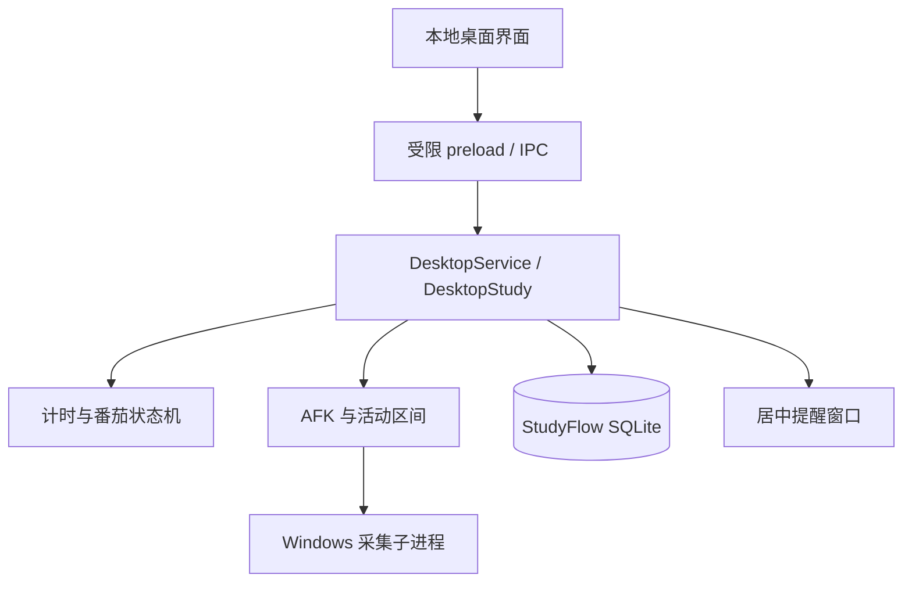

# 开发、构建与验证

当前桌面构建版本为 `0.5.0-local`，数据库 schema v7。本文说明如何从源码构建与复现验证；仓库文件范围见[公开文档约定](../repository-hygiene.md)。

## 技术结构

独立版使用 TypeScript、Electron、本地 HTML/CSS、Node 内置 SQLite 和 Windows C# 采集子进程。



| 目录 | 职责 |
| --- | --- |
| `src/timer/` | 与 UI、Electron 和存储无关的计时状态机及番茄策略 |
| `src/activity/` | AFK 策略、串行采样、活动区间和有效学习交集 |
| `src/desktop/study.ts` | 组合计时、采样、提醒和检查点的应用服务 |
| `src/desktop/store.ts`、`history.ts`、`daily.ts` | SQLite 任务、历史、每日计划与复盘 |
| `src/desktop/main.ts` | Electron 窗口、托盘、IPC、电源事件和退出生命周期 |
| `src/desktop/preload.ts`、`renderer.ts`、`daily-renderer.ts` | 受限 IPC API 和 DOM 交互 |
| `desktop/` | 本地页面和样式 |
| `native/WindowSampler.cs` | Windows 前台应用与最后输入时间采样 |
| `src/focus/` | 独立版复用的纯白名单判断，以及旧插件控制器 |
| `third-party/` | 上游来源、固定 commit 和许可证材料 |

Super Productivity 只按需复用了任务剩余时间计算；ActivityWatch 的 Windows 前台窗口获取流程固定到指定 commit 后移植为 C#。来源、修改和许可证见 [源码复用记录](../source-reuse.md)。

## 开发环境与首次安装

使用 Windows x64 和 Node.js 24；`package.json` 的最低声明为 Node >=22，桌面构建目标与本文复现基线为 Node 24。桌面构建脚本使用 Windows 自带 .NET Framework 4.x 的 `csc.exe` 编译 C# 辅助程序；不需要 Python。Electron 与其他依赖版本由 `package-lock.json` 固定。

在仓库根目录执行：

```powershell
npm ci
npm run install:electron
npm run start:desktop
```

`npm ci` 按锁文件安装依赖。当前 Electron npm 包没有自动安装二进制的 `postinstall`，因此应继续执行 `npm run install:electron`。该脚本使用项目 `.cache/electron` 缓存，检测到二进制已安装时直接退出。首次安装需要能访问依赖下载源。

正常启动无需 `.env`、API key 或账号配置；偏好通过界面保存到本地 SQLite。仅在隔离调试或音频验证时按需设置环境变量，下列路径均为占位示例：

```powershell
$env:STUDYFLOW_DATA_DIR = '<独立测试数据目录>'
$env:FFMPEG_PATH = '<已安装的 ffmpeg.exe 完整路径>'
```

不要将真实用户目录、数据库或机器专属配置提交到 Git。`node_modules/`、`.cache/`、`dist/`、`release/` 不会随 Git 克隆取得；验证截图、测试数据、包路径指针和便携包属于本地生成产物，需要按命令重新生成。

## 常用命令

```powershell
npm test
npm run typecheck
npm run lint
npm run build:desktop
npm run verify:focus-mini
npm run verify:plan
npm run verify:frontend
npm run package:desktop
npm run verify:package
```

- `npm test`：工作区全量 Vitest 回归，排除 `release/**` 历史产物；作为全量测试结果的依据。
- `test:desktop`：仅运行脚本中列出的部分桌面测试，覆盖计时、AFK、SQLite、历史、每日计划等；不覆盖所有导入、提醒、小窗、管理、音频及交付测试，不能替代 `npm test`。
- `lint`：TypeScript 无输出编译，并检查未使用局部变量和参数。
- `build:desktop`：类型检查、编译 C# 采集器并打包 Electron 主进程、preload 和 renderer。
- `verify:m3`：用临时数据目录启动真实 Electron，验证原生协议、preload/IPC、模式、托盘、历史、每日页面和重启持久化。
- `verify:focus-mini` / `verify:plan`：专注小窗、粘贴导入及每日提醒的 Windows Electron 集成验证；先生成桌面构建。
- `verify:frontend`：使用真实 renderer/preload、虚构 SQLite 数据与隐藏 Electron 窗口，检查导航、草稿、持续计时、任务菜单键盘操作及尺寸/缩放布局；先生成桌面构建。输出的截图和指标留在本地。详见[界面使用指南](12-frontend-layout.md)。
- `verify:ambient`：真实播放器与虚构 WAV/MP3 验证；需 `FFMPEG_PATH` 指向已安装的 FFmpeg，或 `PATH` 中可直接运行 `ffmpeg`。FFmpeg 只生成测试音频，不是应用运行依赖，也不进入交付包。
- `package:desktop`：生成完整 Windows x64 便携目录；不能只分发 exe。
- `verify:package`：验证最终便携目录，不等同于开发构建验证。
- `verify:delivery -- --package <便携目录>`：核验指定完整包的 SHA-256 交付清单。

旧插件使用 `npm run build` 和 `npm run verify:plugin`，它们不验证独立桌面版。

## 专属测试版

完成首次依赖与 Electron 安装后，在仓库根目录执行：

```powershell
npm run package:test-app
```

该命令构建测试版、打包便携目录，并加入测试清单、虚构导入文件及 SHA-256 清单。
便携目录记录在 `dist/test-package-path.txt`，测试 ZIP 路径记录在 `dist/test-kit-path.txt`；
两者均在本机构建后生成。只生成测试版开发文件可使用 `npm run build:test-app`，输出为 `dist/desktop-test/`。
测试版运行 `StudyFlow-Test.exe`，默认数据位于 `%APPDATA%/StudyFlow-Test`，与正常版分开。
长时间验收步骤见 [8 小时测试清单](../eight-hour-test-checklist.md)。

## 验证范围

纯逻辑与 SQLite 回归覆盖计时边界、AFK 修正、事务、迁移、导入去重、日计划和复盘；DOM 回归覆盖表单、菜单与草稿保护。测试数据使用虚构内容，不读取真实用户数据库。

Windows 集成脚本分别检查实际 Electron/preload、原生采集协议、提醒、专注小窗、音频和最终便携包。前端检查覆盖 1280×720、1366×768 的 100%/125%/150% 缩放，以及 1920×1080 的 100% 缩放；包含按日/月历、长专注/微休息、声音设置、导入预览、控件滚动可达与中心点遮挡检查。输入通过 Chromium 协议验证 Enter、Tab、Escape；模拟采集和通知不能证明真实系统通知或声音可见、可听。

运行命令时核对退出状态及生成的结果文件。结果只适用于被检查的源码、构建和虚构数据场景，不将历史通过次数或构建成功当作当前机器的完整验收。

## 发布与人工验收边界

源码仓库不包含便携包或本机运行数据；构建后从路径记录文件取得完整便携目录。签名状态和 SHA-256 校验流程见[本地交付说明](../local-delivery.md)。当前没有配置在线自动更新源，使用新的完整本地包升级。

物理锁屏、真实休眠/唤醒、跨午夜实际等待、长时间连续运行、多显示器小窗拖动、声音听感及干净 Windows 机器兼容性仍需单独验证。事件注入、模拟时钟和编译通过不替代这些实测。

数据库升级和降级按[schema v7 备份恢复说明](07-data-backup-and-recovery.md)执行。本地打包或验证成功不代表应用已安装到用户目录，也不代表分发包已公开发布。
